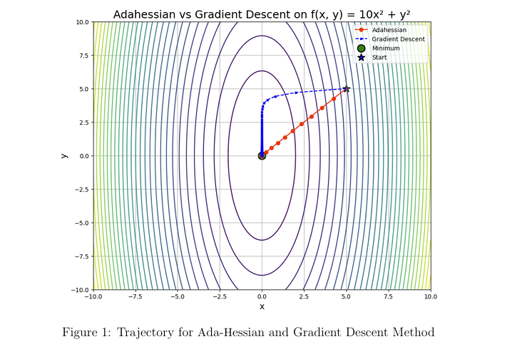
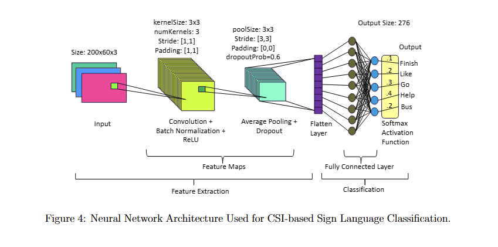
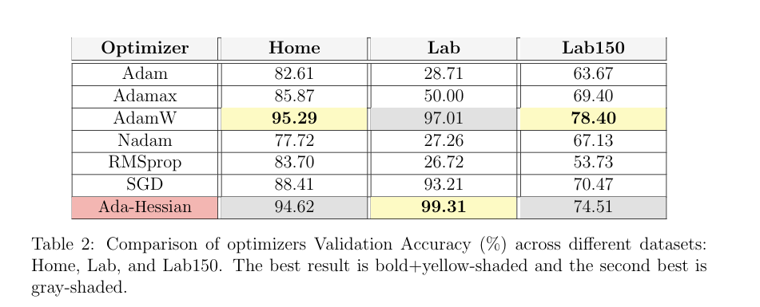

# Comparative-Analysis-of-Ada-Hessian-and-1st-Order-Optimizers-for-CSI-Based-Sign-Language-Recognition


This repository contains the implementation and experimental analysis of ***Ada-Hessian***, a second-order optimization method, compared against several **first-order optimizers** for **CSI-based sign language recognition**.

The project was completed for **AMAT 591: Optimization Methods and Nonlinear Programming (Spring 2025)** at the **University at Albany**.


###### **📌 Project Overview**


First-order optimizers such as SGD and Adam dominate deep learning due to their efficiency but are often highly sensitive to hyperparameter choices. This project investigates whether incorporating \*\*second-order curvature information\*\* via ***Ada-Hessian*** can improve convergence speed, stability, and robustness when training neural networks on **WiFi CSI-based sign language data**.


**The study includes:**


* An implementation of **Ada-Hessian using Hutchinson’s method** for Hessian diagonal approximation
* **Spatial (block-wise) averaging** to reduce stochastic curvature noise
* Extensive comparison with **SGD, Adam, AdamW, Adamax, Nadam, and RMSprop**.
* Evaluation on multiple CSI datasets, including single-user and multi-user settings


###### &nbsp;📁 Repository Structure


```

├── Code/

│   ├── adahessian\_sample\_usage          # Sample code for demonstration.

│

├── Data/

│   └── Home/                            # Subset of the Home CSI dataset (for demonstration)

│

├── Results/

│   ├── plots/                           # Training/validation curves

│

├── Deliverables/

│   ├── Project Report.pdf               # Final project report

│   ├── AMAT\_591\_Project\_Proposal.pdf    # Initial project proposal

│   └── Poster\_Joy.pdf                   # Project poster

│

├── Materials/

│   ├── signfi\_paper.pdf                 # Sign-Fi dataset reference paper

│   └── adahessian\_paper.pdf             # Ada-Hessian original paper

│

└── README.md

```


###### **🧠 Problem Formulation**


The learning objective is to minimize a non-convex empirical risk function:


$$

\min\_{\theta} ; L(\\theta) = \frac{1}{N}\\sum\_{i=1}^{N} \ell(x\_i, y\_i; \theta)

$$





While first-order methods rely only on gradient statistics, Ada-Hessian preconditions gradients using an approximate inverse Hessian, enabling curvature-aware updates that adapt to the geometry of the loss surface.


###### ⚙️ Methodology


**Ada-Hessian Key Components**


* &nbsp;Hessian diagonal approximation via Hutchinson’s method
* &nbsp;Block-wise spatial averaging of curvature estimates
* &nbsp;Momentum-based smoothing, similar to Adam
* Tunable Hessian power parameter (k) to interpolate between gradient descent and Newton-like behavior


**Neural Network Architecture**





* CNN-based classifier for CSI tensors of shape `(200 × 60 × 3)`
* Convolution + BatchNorm + ReLU
* Average pooling and dropout
* Fully connected layer with softmax activation


📊 Experimental Setup


CSI Datasets


| Dataset | # Signs | Repetitions | # Instances |

| ------- | ------- | ----------- | ----------- |

| Home    | 276     | 10          | 2,760       |

| Lab     | 276     | 20          | 5,520       |

| Lab150  | 150     | 10          | 7,500       |


> ⚠️ Due to size constraints, only a subset of the Home dataset is included in this repository under `Data/`.


**Training Configuration**


* &nbsp;Batch size: 256
* &nbsp;Epochs: up to 300 (Ada-Hessian typically converges within ~50 epochs)
* &nbsp;Weight decay: (5 \\times 10^{-4})
* &nbsp;Learning rate:

&nbsp;                First-order optimizers: 0.01

&nbsp;                Ada-Hessian: 0.15

* Learning rate decay at epochs 80, 160, and 240


###### 

###### **📈 Results Summary**


1. Ada-Hessian converges significantly faster than first-order optimizers
2. Demonstrates smooth and stable training behavior
3. Achieves highest validation accuracy on the Lab dataset
4. Performance is competitive with AdamW, the strongest first-order baseline
5. 




Detailed results for all configurations (learning rates, Hessian power values, weight decay settings) are available in the `Results/` directory.


###### **⏱️ Computational Trade-offs**


1. Ada-Hessian incurs 3–5× higher training time due to Hessian estimation
2. However, it **requires far fewer epochs to converge**, reducing tuning effort
3. Particularly effective in high-variability and multi-user CSI settings


###### **✅ Conclusions**


* Ada-Hessian is a robust and efficient optimizer for CSI-based sign language recognition
* Less sensitive to learning rate selection than first-order methods
* Weight decay remains an important hyperparameter
* Demonstrates the practical benefits of second-order information in real-world deep learning tasks


###### 📚 References


1.Yongsen Ma, Gang Zhou, Shuangquan Wang, Hongyang Zhao, and Woosub Jung. Signfi: Sign language recognition using wifi. Proc. ACM Interact. Mob. Wearable Ubiquitous Technol., 2(1):Article 23, 21 pages, March 2018.


2\. Zhewei Yao, Amir Gholami, Sheng Shen, Kurt Keutzer, and Michael W. Mahoney. Adahessian: An adaptive second order optimizer for machine learning. AAAI (Accepted), 2021.


###### **Project Status**


✅ Completed — Baseline implementation


🔧 Open for enhancements and upgrades


###### **Acknowledgements**


The initial components of this project, including CSI data preprocessing and baseline pipeline development, were carried out during my undergraduate research. Details of that work can be found at [here](https://github.com/Joysaha189/Implementation-Friendly-CNN-For-Sign-Language-Recognition-Using-Wi-Fi-CSI-Data).


I sincerely thank my undergraduate supervisors, Dr. Hafiz Imtiaz and Dr. Tahsina Farah Sanam, for their guidance and foundational contributions, which made this work possible.


The Ada-Hessian optimizer implementation in this project is adapted from the original [AdaHessian](https://github.com/amirgholami/adahessian) paper and its publicly available resources . The dataset and baseline model architecture are based on the SignFi framework ([https://yongsen.github.io/SignFi/](https://yongsen.github.io/SignFi/)).


I am also grateful to Dr. Zi Yang for his valuable guidance and feedback throughout the completion of this project as part of AMAT 591.


###### **Author**


**Joy Saha**


University at Albany, SUNY


###### **License**


This project is for academic and educational purposes.


